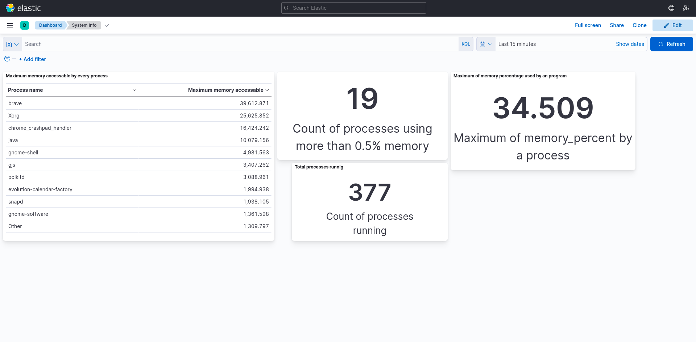

## System Stats Visualizer
<li>This project is created to visualize the system statistics such as memory usage, CPU usage, memory accessible by process and much more using Kibana Dashboard with Elasticsearch.</li>

---

## Installation 
<li><b>Requirements: </b>Python, Elasticsearch, Kibana</li>

Create a Virtual Environment:  

<code>
pip install pyenv
  </code> 
  <code>
pyenv install 3.9.7
  </code> 
<code>pyenv virtualenv system-stats-env</code> 
<code>pyenv local system-stats-env</code> 
 
 
Install requirements using:
<code>pip install -r requirements.txt</code>
 
 
<b>Install Elasticsearch</b> for your system, <a href="https://www.elastic.co/guide/en/elasticsearch/reference/current/install-elasticsearch.html">click here</a> to check the instruction for your system.
 
 
<b>Install Kibana</b> for your system, <a href="https://www.elastic.co/guide/en/kibana/current/install.html">click here</a> to check the instruction for your system.
 

---

## Starting the project
<li>Start elasticsearch and kibana service dependig on your OS.</li>
<li>Go to project folder and execute: <code>python system-info.py</code></li>
<li>Now visit kibana service at <code>http://localhost:5601</code></li>
<li>Go to <code>Menu > Stack Management > Saved Object</code> and click import to import dashbord preset from you rproject folder named <code>export.ndjson</code></li>
<li>to view dashboard visit go to <code>Menu > Dashboard > System_Info </code></li>
<li>Stats update every 5 minutes, click refresh to check the latest stats. </li>
<li>you can modify the dashboard by clicking create visualization.</li>

---

## Dashboard Preview

### Hope you like it.
